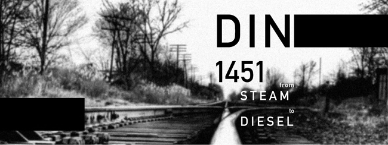
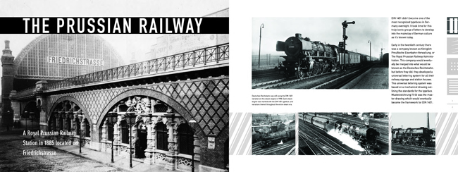
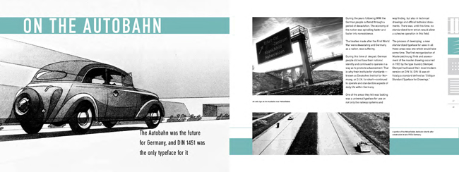
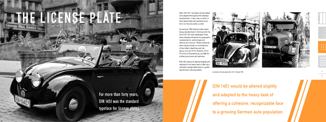
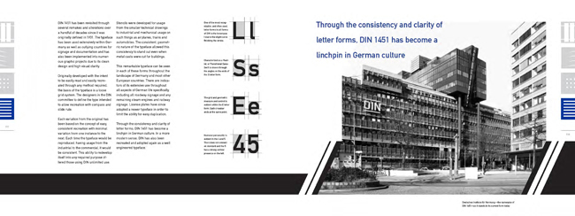

  <header class="post-header">
     <h1 class="post-title">{{ page.title }}</h1>
  </header>
  DIN is a wonderful typeface and I have no issues celebrating its
  versatility and cleanliness. My love for DIN came about before
  this project, but this project solidified it for good. The project
  focuses on creating a system that can be used as a framework
  for hundreds of pages of content. The layout style is a nod to
  older German design which I love. The type is heavy on the
  page and both color and image are heavy but precise. There is
  a sense of order and intent with an aesthetic that is one notch
  under overwhelming.  

<section class="portfolio-image-wrapper">   
   
   
   
   
   
   
</section>