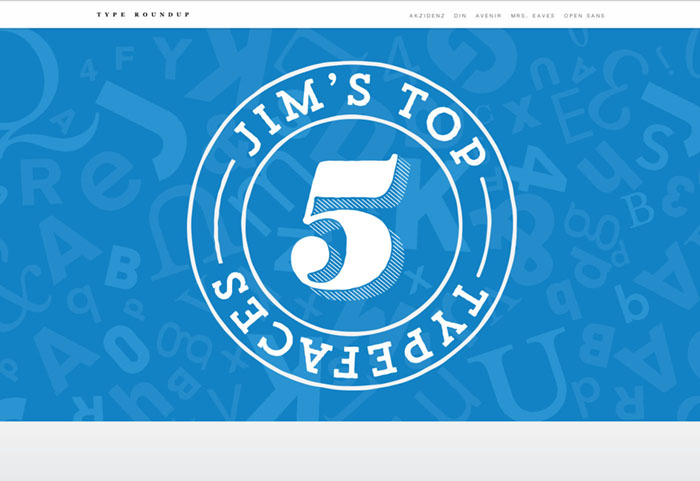
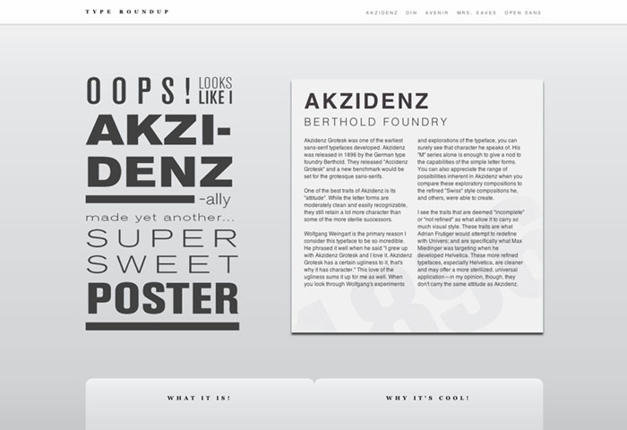
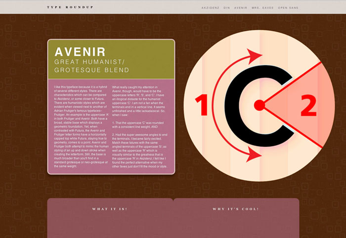
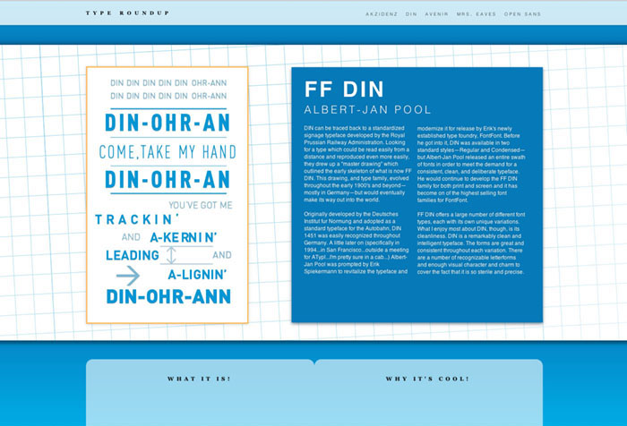
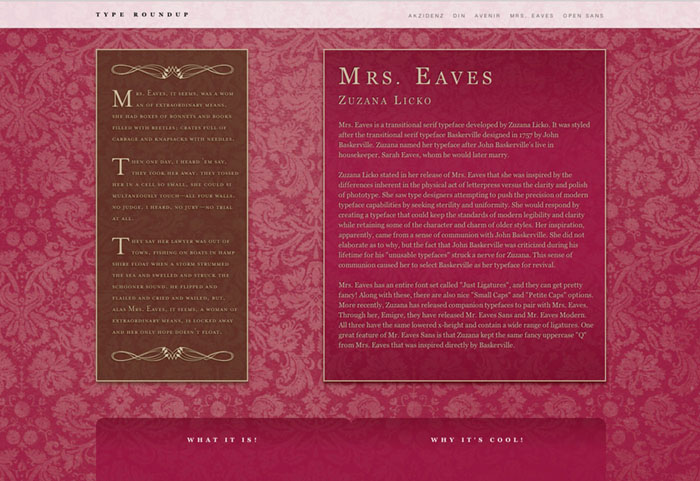
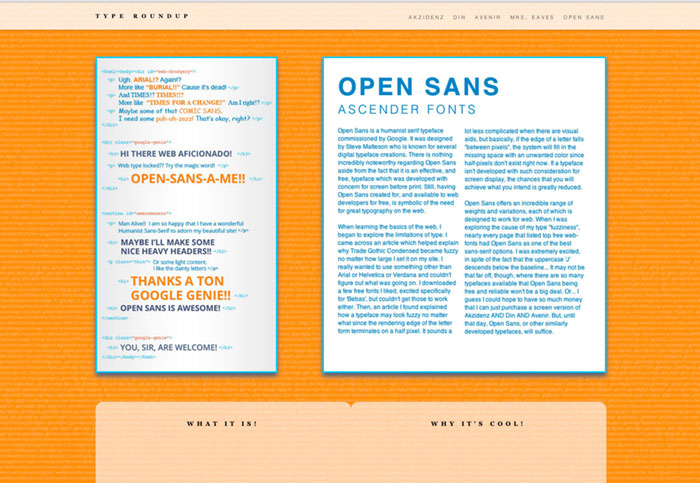

  <header class="post-header">
   <h1 class="post-title">{{ page.title }}</h1>
  </header>
  This single page website is a fun exploration of my favorite
  typefaces. Each typeface has a history section and a section
  for my own take on the unique aspects. My primary goal in this
  project was to develop a single page with numerous dynamic
  elements and sections that are able to swap without burdening
  the user with page reloads and excessive navigation. I want
  my ideas to be quickly digested while offering more in-depth
  exploration if the user is intrigued.  

 
<section class="portfolio-image-wrapper">

</section>