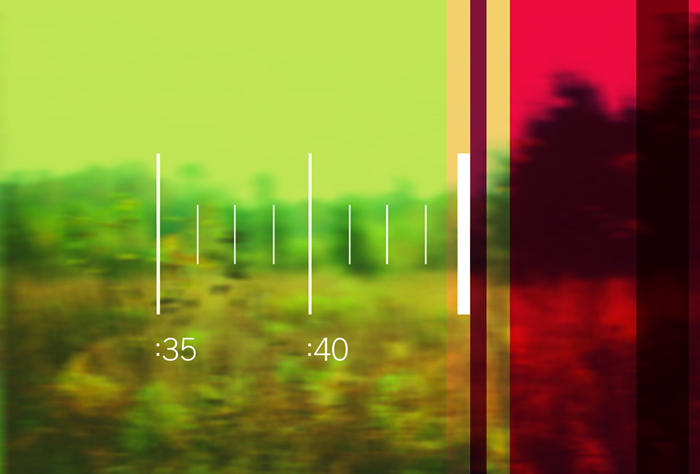
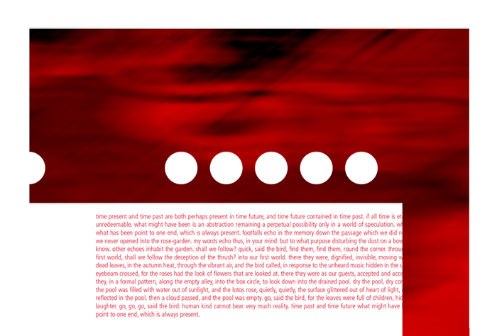
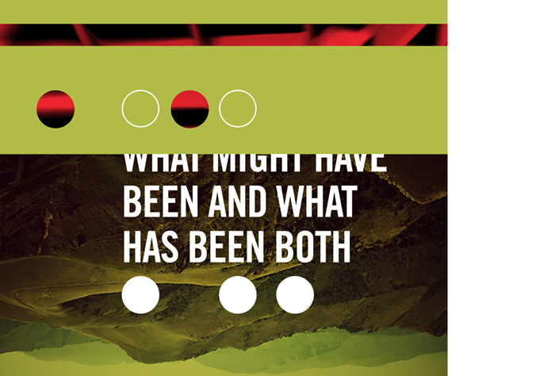
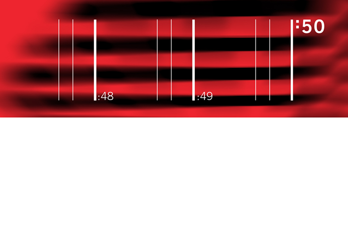
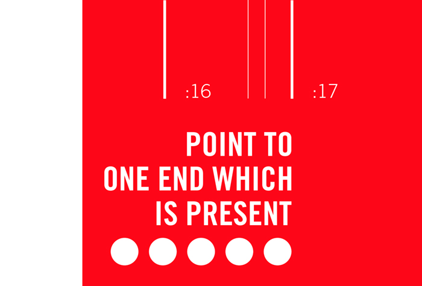
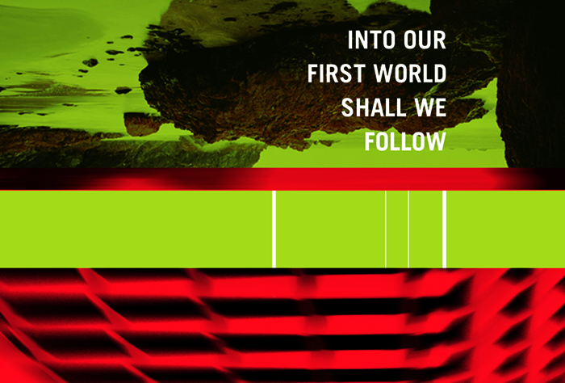

  <header class="post-header">
   <h1 class="post-title">{{ page.title }}</h1>
  </header>
An examination of T.S. Eliot's poem *Burnt Norton*, this project was created in the style of an Eames House of Cards. Developed with the intent to be built, these cards offer distinct, yet unified, visual elements that attempt to explain on aspect of Eliot's epic poem. The passing of time and the balance of perception and reality and its impact upon this passing play out in a sequential series of images. The panels vary between literal and non-representational, but each is meant to remind us of the passing of time, both present and future.     

    
    
<section class="portfolio-image-wrapper">

</section>