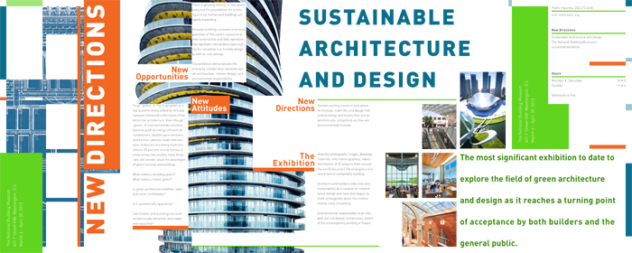
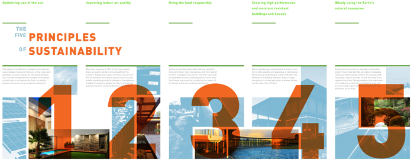

  <header class="post-header">
   <h1 class="post-title">{{ page.title }}</h1>
  </header>
  A brochure for an exhibition relating to advancements in green
  architecture. The brochure measures 10”x25” and folds into five
  panels. Presented as front is the “New Directions” panel which
  depicts the grid system utilized throughout. On the reverse is a
  series of informational panels that explain the principles on
  which said architecture is based.    

  This brochure is an experiment in layout, focusing on control of
  content (both image and text) while retaining a strong, concise
  visual flow.

<section class="portfolio-image-wrapper">

</section>