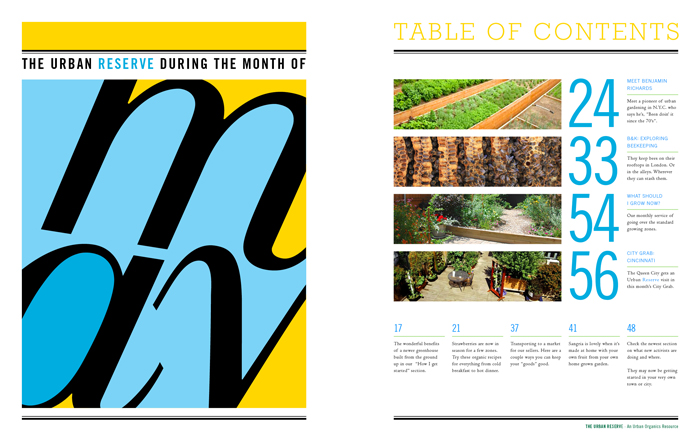
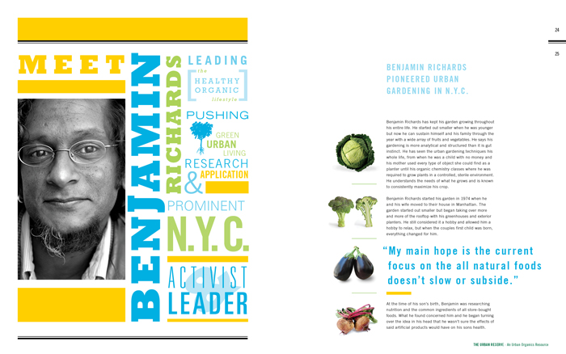
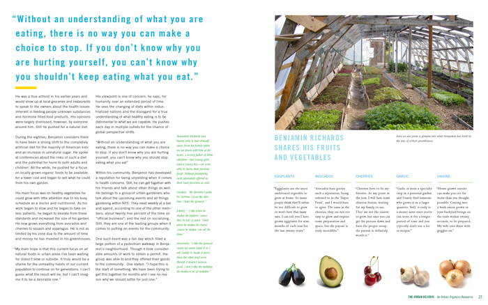
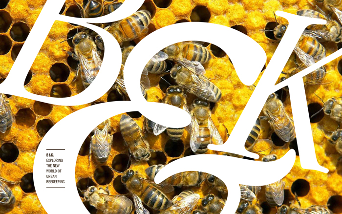
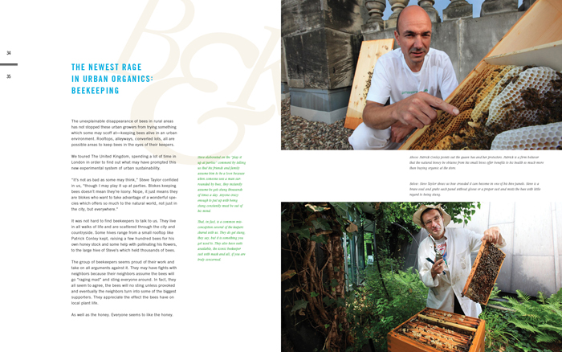
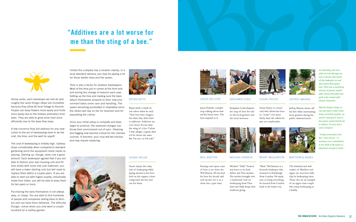
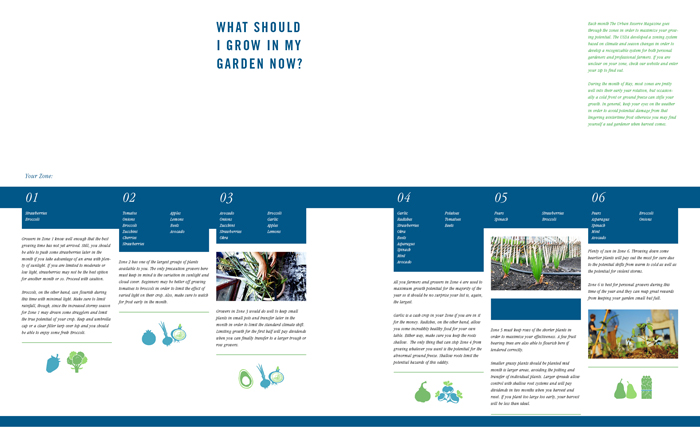
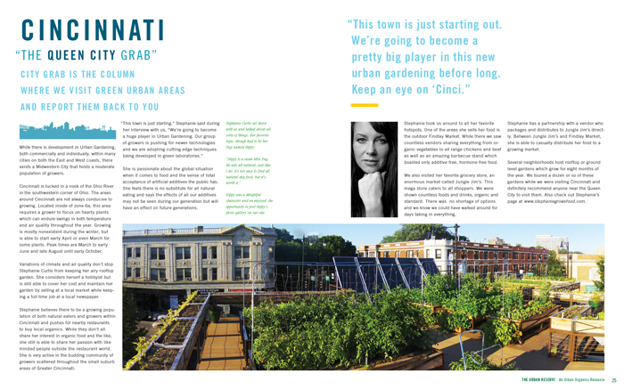

  <header class="post-header">
   <h1 class="post-title">{{ page.title }}</h1>
  </header>
  The Urban Reserve is a magazine that focuses on the rise of
  urban gardening. In this project I created a system that can be
  applied to any number of pages in order to keep a consistent
  appearance while still offering dynamic page layouts. Varying
  the number and width of columns to fit content offers flexibility
  in content management while controlled use of color and
  photo styles keep a unified feel. The layout is friendly, inviting,
  and light-hearted.

<section class="portfolio-image-wrapper">

</section>